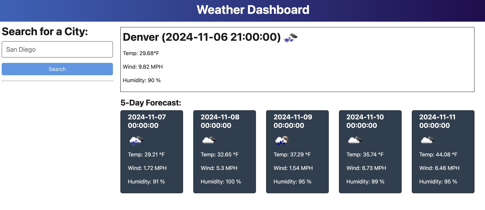

# Weather-App

## Description
This app looks up the weather data for any city across the globe and returns a list of saved cities. You may access it here: https://weather-app-tx11.onrender.com 

## Usage
Screenshot 1:  
  

You can access the app at the link shared above. Or, by using the repo, installing npm first, then running 'npm run build', then 'npm run start', then accessing the app locally.

## Technical Features
This app uses TypesScript, OOP, asynchornous programming, and the openweathermap.org API to pull a weather forecast for any city in the globe. API information: https://openweathermap.org/   
The city name is first converted to latitude and longitude using an initial API call, before making a second API call that converts the lat and lon to the local weather data.  

## Credits & How to Contribute
This was created by Johann Zaroli. Please contact me on GitHub at Jzaroli with any questions or requests.

## License
MIT License

Copyright (c) <2024>

Permission is hereby granted, free of charge, to any person obtaining a copy of this software and associated documentation files (the "Software"), to deal in the Software without restriction, including without limitation the rights to use, copy, modify, merge, publish, distribute, sublicense, and/or sell copies of the Software, and to permit persons to whom the Software is furnished to do so, subject to the following conditions:

The above copyright notice and this permission notice shall be included in all copies or substantial portions of the Software.

THE SOFTWARE IS PROVIDED "AS IS", WITHOUT WARRANTY OF ANY KIND, EXPRESS OR IMPLIED, INCLUDING BUT NOT LIMITED TO THE WARRANTIES OF MERCHANTABILITY, FITNESS FOR A PARTICULAR PURPOSE AND NONINFRINGEMENT. IN NO EVENT SHALL THE AUTHORS OR COPYRIGHT HOLDERS BE LIABLE FOR ANY CLAIM, DAMAGES OR OTHER LIABILITY, WHETHER IN AN ACTION OF CONTRACT, TORT OR OTHERWISE, ARISING FROM, OUT OF OR IN CONNECTION WITH THE SOFTWARE OR THE USE OR OTHER DEALINGS IN THE SOFTWARE.
